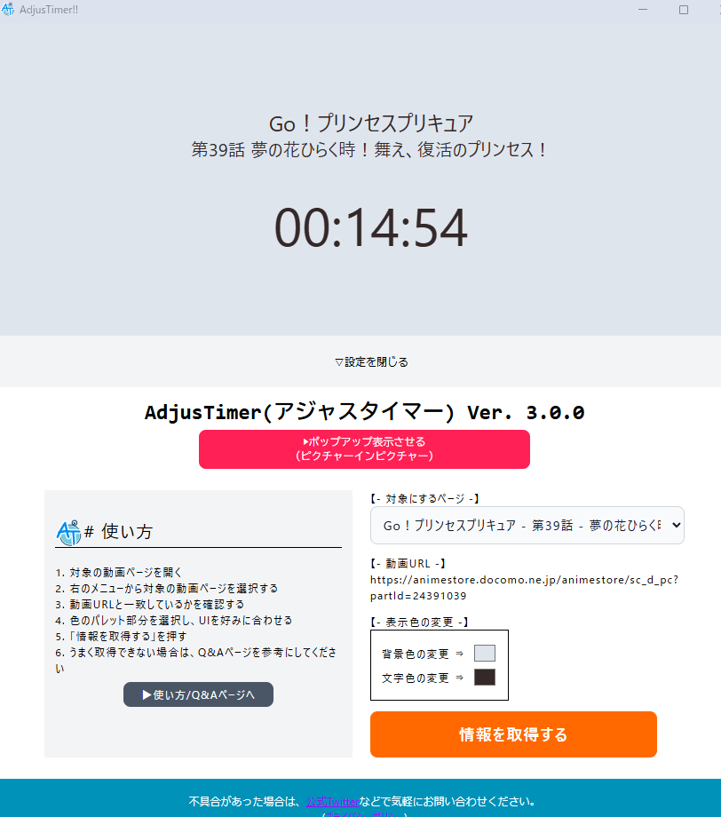
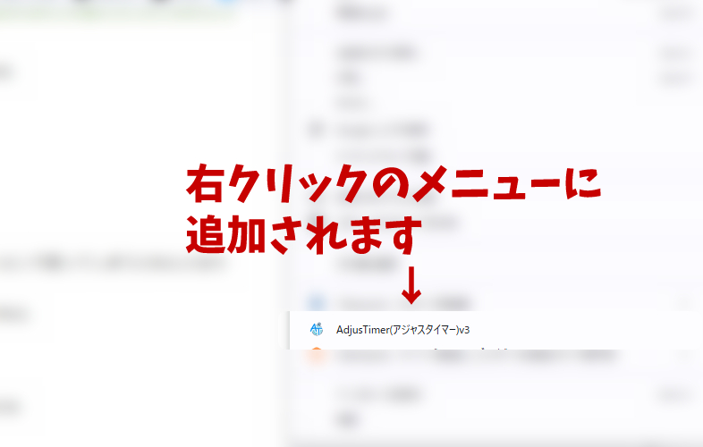

<div align="center">
  <br>
 
  <br>
  <h2>
    AdjusTimer V3
    <br>
  </h2>
</div>

<p align="center">
  dアニメストア・Amazon Prime Videoなどの動画再生時間（タイマー）を別ウィンドウで表示することのできるchrome拡張。配信者向けの同時視聴用のタイマー。
</p>
<p align="center">
  タイトル取得 ・現在時間取得 が可能です。
  <br>
  文字色や背景色も変更できるため、OBSのクロマキーも簡単にできます。
</p>
<hr />

<p align="center">
  <a href="#Features / 概要">Features / 概要</a> ·
  <a href="#Getting Started / スタートガイド">Getting Started / スタートガイド</a> ·
  <a href="#license">License</a>
</p>

## Features / 概要

- 再生している動画の再生時間とタイトルを表示する
- 対応済みサービス
  - d アニメストア
  - Amazon Prime Video(予定）



## Getting Started / スタートガイド

> **使い方ページ、利用規約の詳細は** **[こちら](http://patiopatimon.com/adjustimer/) を確認ください。**

chrome ウェブストアからインストール

1. インストールする ⇒ https://chrome.google.com/webstore/detail/adjustimer/cbolehniipnbcbmecpekldhjhnohifpm

2. 対象とする動画画面を表示しておく（あとでも問題はないです）

3. 右クリックから「AdjusTimer(アジャスタイマー)」の項目を選択する。



4. 起動後、AdjusTimer側の「対象にするページ」から、動画のタブ情報を選択すると、情報が反映されます。（動画タブ情報は対応済みサービスのURLしか検知しません）


# React + TypeScript + Vite

## ローカルで試したい

```
npm run dev
```

## ビルドしたい

```
npm run build
```

雛型参考
https://qiita.com/mi___y/items/3f7bc09e9177e023110d

## License

This software is released under the MIT License, see LICENSE.
MIT © [patioglass](https://patiopatimon.com/)