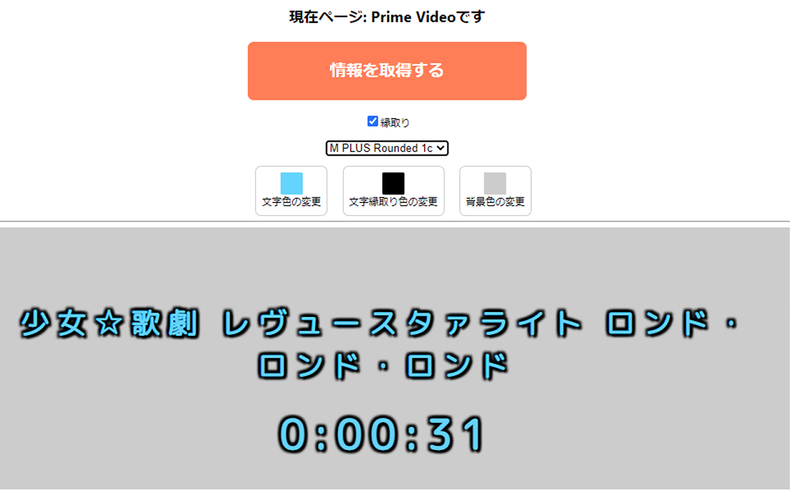
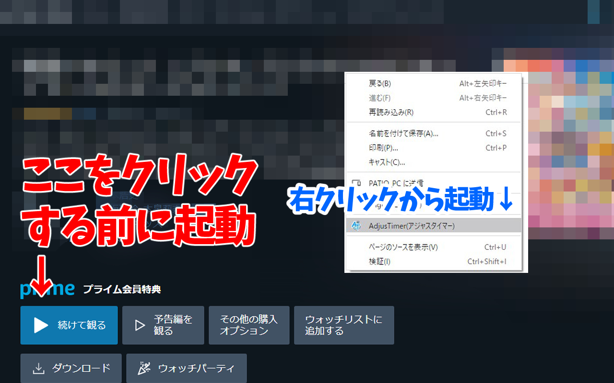

# AdjusTimer
Amazon Prime Videoの現在視聴時間を別ウィンドウで表示することのできる拡張
・タイトル取得
・現在時間取得
が可能です。

https://chrome.google.com/webstore/detail/adjustimer/cbolehniipnbcbmecpekldhjhnohifpm

# 使い方
https://www.youtube.com/watch?v=Dlw-WGnG1j4

・拡張をインストール後、右クリックから「AdjusTimer(アジャスタイマー)」の項目を選択する。
※対象とするAmazon Prime Videoの「今すぐに観る」「続きから観る」などのボタンを押す前に起動してください

・起動後、対象とするAmazon Prime Videoの「今すぐに観る」「続きから観る」をクリックし、ムービーが再生されると同時に情報が反映されます。

・「グリーンバックにする」チェックを付けることでグリーンバックにすることが可能なため、配信ツールのクロマキー設定などで活用していただけると思います。

# LICENSE
This software is released under the MIT License, see LICENSE.txt.